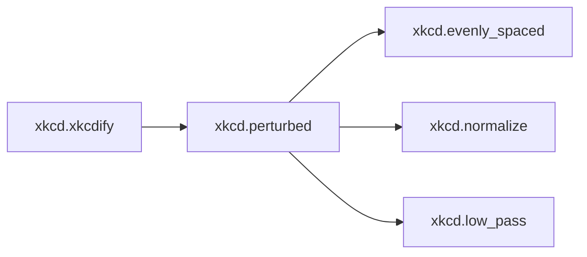
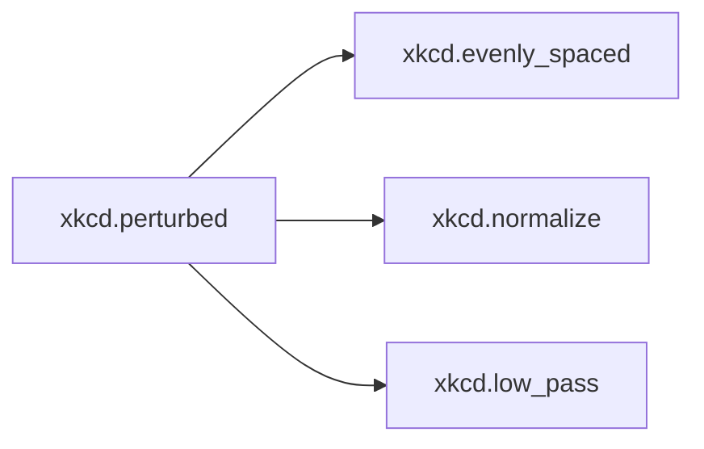
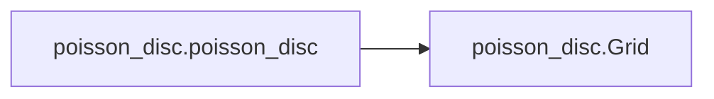

# Key Objects

[_Documentation generated by Documatic_](https://www.documatic.com)

<!---Documatic-section-xkcd.xkcdify-start--->
## xkcd.xkcdify

<!---Documatic-section-xkcdify-start--->


### Object Calls

* xkcd.perturbed

<!---Documatic-block-xkcd.xkcdify-start--->
<details>
	<summary><code>xkcd.xkcdify</code> code snippet</summary>

```python
def xkcdify(shape, spacing, intensity):
    if isinstance(shape, MultiPolygon):
        return MultiPolygon([xkcdify(child, spacing, intensity) for child in shape.geoms])
    elif isinstance(shape, Polygon):
        return Polygon(perturbed(shape.exterior.coords, spacing, intensity))
    elif isinstance(shape, LineString):
        return LineString(perturbed(shape.coords, spacing, intensity))
    else:
        raise Exception('unsupported shape')
```
</details>
<!---Documatic-block-xkcd.xkcdify-end--->
<!---Documatic-section-xkcdify-end--->

# #
<!---Documatic-section-xkcd.xkcdify-end--->

<!---Documatic-section-xkcd.perturbed-start--->
## xkcd.perturbed

<!---Documatic-section-perturbed-start--->


### Object Calls

* xkcd.evenly_spaced
* xkcd.normalize
* xkcd.low_pass

<!---Documatic-block-xkcd.perturbed-start--->
<details>
	<summary><code>xkcd.perturbed</code> code snippet</summary>

```python
def perturbed(points, spacing, intensity):
    result = []
    points = evenly_spaced(points, spacing)
    noises = [random.random() * 2 - 1 for _ in range(len(points) // 2)]
    for _ in range(3):
        noises = low_pass(noises, 0.3)
    noises = normalize(noises, -1, 1)
    noises = noises + list(reversed(noises))
    for ((x1, y1), (x2, y2), noise) in zip(points, points[1:], noises):
        a = math.atan2(y2 - y1, x2 - x1) + math.pi / 2
        x = x1 + math.cos(a) * intensity * noise
        y = y1 + math.sin(a) * intensity * noise
        result.append((x, y))
    return result
```
</details>
<!---Documatic-block-xkcd.perturbed-end--->
<!---Documatic-section-perturbed-end--->

# #
<!---Documatic-section-xkcd.perturbed-end--->

<!---Documatic-section-alpha_shape.alpha_shape-start--->
## alpha_shape.alpha_shape

<!---Documatic-section-alpha_shape-start--->
<!---Documatic-block-alpha_shape.alpha_shape-start--->
<details>
	<summary><code>alpha_shape.alpha_shape</code> code snippet</summary>

```python
def alpha_shape(points, alpha):

    def add_edge(points, i, j):
        if (i, j) in edges or (j, i) in edges:
            return
        edges.add((i, j))
        edge_points.append((points[i], points[j]))
    tri = DelaunayTri(points)
    edges = set()
    edge_points = []
    for (i1, i2, i3) in tri.vertices:
        (x1, y1) = tri.points[i1]
        (x2, y2) = tri.points[i2]
        (x3, y3) = tri.points[i3]
        a = hypot(x1 - x2, y1 - y2)
        b = hypot(x2 - x3, y2 - y3)
        c = hypot(x3 - x1, y3 - y1)
        s = (a + b + c) / 2.0
        area = sqrt(s * (s - a) * (s - b) * (s - c))
        radius = a * b * c / (4 * area)
        if radius < 1.0 / alpha:
            add_edge(tri.points, i1, i2)
            add_edge(tri.points, i2, i3)
            add_edge(tri.points, i3, i1)
    shape = cascaded_union(list(polygonize(MultiLineString(edge_points))))
    return shape
```
</details>
<!---Documatic-block-alpha_shape.alpha_shape-end--->
<!---Documatic-section-alpha_shape-end--->

# #
<!---Documatic-section-alpha_shape.alpha_shape-end--->

<!---Documatic-section-poisson_disc.poisson_disc-start--->
## poisson_disc.poisson_disc

<!---Documatic-section-poisson_disc-start--->


### Object Calls

* poisson_disc.Grid

<!---Documatic-block-poisson_disc.poisson_disc-start--->
<details>
	<summary><code>poisson_disc.poisson_disc</code> code snippet</summary>

```python
def poisson_disc(x1, y1, x2, y2, r, n):
    x = x1 + (x2 - x1) / 2.0
    y = y1 + (y2 - y1) / 2.0
    active = [(x, y)]
    grid = Grid(r)
    grid.insert(x, y)
    while active:
        (ax, ay) = random.choice(active)
        for i in range(n):
            a = random.random() * 2 * pi
            d = random.random() * r + r
            x = ax + cos(a) * d
            y = ay + sin(a) * d
            if x < x1 or y < y1 or x > x2 or (y > y2):
                continue
            if not grid.insert(x, y):
                continue
            active.append((x, y))
            break
        else:
            active.remove((ax, ay))
    return grid.points()
```
</details>
<!---Documatic-block-poisson_disc.poisson_disc-end--->
<!---Documatic-section-poisson_disc-end--->

# #
<!---Documatic-section-poisson_disc.poisson_disc-end--->

<!---Documatic-section-poisson_disc.Grid-start--->
## poisson_disc.Grid

<!---Documatic-section-Grid-start--->
<!---Documatic-block-poisson_disc.Grid-start--->
<details>
	<summary><code>poisson_disc.Grid</code> code snippet</summary>

```python
class Grid(object):

    def __init__(self, r):
        self.r = r
        self.size = r / 2 ** 0.5
        self.cells = {}

    def points(self):
        return self.cells.values()

    def normalize(self, x, y):
        i = int(floor(x / self.size))
        j = int(floor(y / self.size))
        return (i, j)

    def nearby(self, x, y):
        result = []
        (i, j) = self.normalize(x, y)
        for p in range(i - 2, i + 3):
            for q in range(j - 2, j + 3):
                if (p, q) in self.cells:
                    result.append(self.cells[p, q])
        return result

    def insert(self, x, y):
        for (bx, by) in self.nearby(x, y):
            if hypot(x - bx, y - by) < self.r:
                return False
        (i, j) = self.normalize(x, y)
        self.cells[i, j] = (x, y)
        return True
```
</details>
<!---Documatic-block-poisson_disc.Grid-end--->
<!---Documatic-section-Grid-end--->

# #
<!---Documatic-section-poisson_disc.Grid-end--->

[_Documentation generated by Documatic_](https://www.documatic.com)